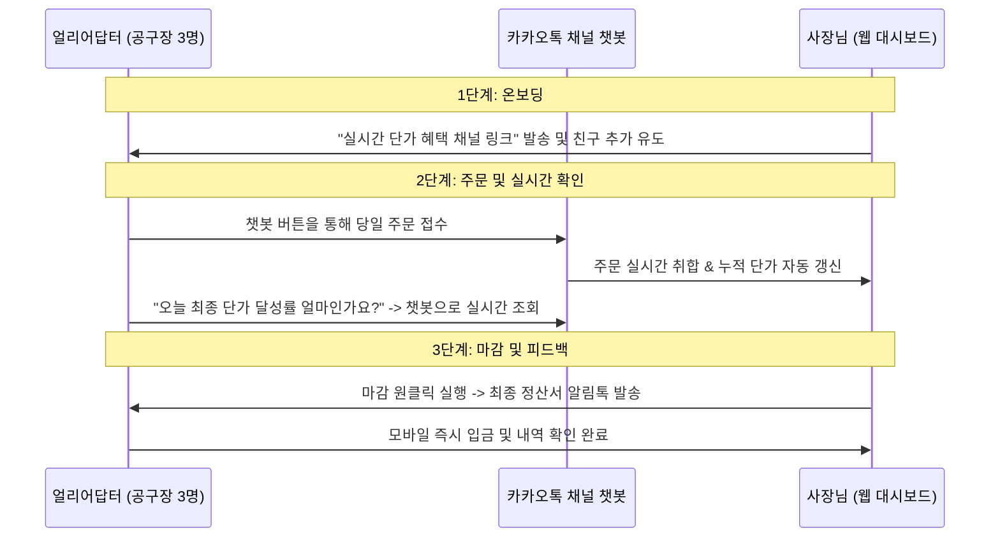

# 얼리어답터 (Early Adopter) 선정 및 공략 전략

본 공동구매 주문 관리 서비스의 첫 번째 MVP 검증 단계를 성공적으로 이끌기 위해, 가장 전환 가능성이 높고 피드백을 신속하게 줄 수 있는 **최적의 얼리어답터 집단**을 정의하고 선정 전략을 제시합니다.

---

## 1. 얼리어답터 세그먼트 분류 및 매트릭스 분석

식품 도매업체(공급자)와 거래하는 20~30명의 업자들은 다음과 같은 성격으로 분류될 수 있습니다.

| 세그먼트 | 디지털 숙련도 | 공동구매 주문 빈도 | 사장님과의 관계 및 소통 | 얼리어답터 적합도 |
| :--- | :--- | :--- | :--- | :--- |
| **A. 지역 커뮤니티 공구장 (30대~40대 초)** | **최상** (모바일 활용) | **주 3~5회** (고빈도) | 친밀하며 피드백에 적극적 | ⭐⭐⭐⭐⭐ (최적) |
| **B. 소형 오프라인 마트/식자재상 (40대~50대)** | 보통 | 주 2~3회 | 사무적/필요한 대화만 수행 | ⭐⭐⭐ |
| **C. 전통시장 상인 및 고연령 소매상 (50대 이상)** | 낮음 | 주 1~2회 | 전화/수기 소통 선호 | ⭐ (후순위) |

---

## 2. 최적의 얼리어답터(Early Adopter) 정의

우리가 가장 먼저 집중 타겟팅해야 하는 얼리어답터는 **[세그먼트 A: 모바일 기반 지역 커뮤니티 공동구매 연합 대표 (예: 페르소나 2 박민지)]**입니다.

### 🎯 얼리어답터 프로필
* **대상**: 맘카페, 당근마켓 비즈프로필, 아파트 커뮤니티, 혹은 자체 SNS(인스타그램, 밴드)를 통해 회원을 모집하여 도매 농수산물을 정기 공구하는 **3040 젊은 공구 주관자(공구장)** 3~5명.
* **선정 이유**:
  1. **높은 동기부여**: 본인들이 모집한 회원들에게 최종 단가가 낮아질수록 가격 경쟁력이 생기기 때문에, 실시간 공구 현황판 및 단가 변동 조회를 가장 적극적으로 사용할 주체입니다.
  2. **모바일 인터페이스 친화력**: 카카오톡 채널 챗봇이나 모바일 웹 인터페이스를 학습 비용 없이 즉시 사용하고 피드백을 줄 수 있습니다.
  3. **네트워크 효과**: 이들이 시스템에 만족하면 다른 소규모 공구 주관자들을 해당 도매업체로 끌어들이는 바이럴 허브 역할을 수행할 수 있습니다.

---

## 3. 얼리어답터 온보딩 및 검증 시나리오 (1단계 검증)

초기 20~30명 전체를 한 번에 전환하기보다, **선정된 3~5명의 핵심 얼리어답터만을 대상으로 1주일간 파일럿 테스트**를 진행합니다.

### 💡 얼리어답터 유인책 (Incentive)
업자들이 개인 카톡에서 카카오톡 채널 챗봇으로 귀찮음을 무릅쓰고 넘어가게 만들 강력한 유인책이 필요합니다.
* **"실시간 공동구매 현황판 제공"**: "현재 몇 박스 주문되어 할인 혜택이 얼마나 적용되었는지 사장님 답변 기다릴 필요 없이 실시간 확인 가능합니다"를 세일즈 포인트로 내세웁니다.
* **"오류 없는 예약 접수"**: 사장님이 주문을 누락할 걱정 없이 챗봇에서 본인이 주문한 상세 영수증이 카톡으로 즉시 발송된다는 안전성을 강조합니다.
