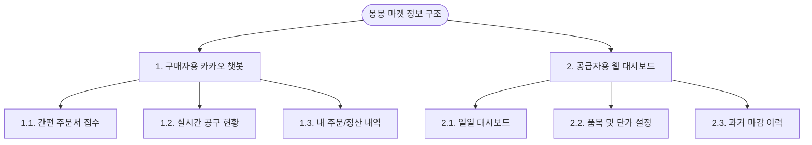

# 정보 구조도 (Information Architecture)

봉봉 마켓(BongBong Market) 공동구매 관리 서비스의 사용자 환경을 직관적으로 구조화한 IA 정보 구조도입니다.  
사용자 유형별로 **구매자(업자)의 카카오 채널 챗봇 인터페이스**와 **공급자(사장님)의 관리자 웹 대시보드** 두 가지 영역으로 나누어 설계했습니다.

---

## 1. IA 전체 계통도 (Overall Map)

---

## 2. 상세 정보 구조도 (Detailed IA)

### 1) 구매자(업자) 인터페이스: 카카오톡 채널 챗봇 & 웹뷰

* **1.0. 카카오톡 채널 채팅방**
  * **1.1. 간편 주문서 접수 (챗봇 대화 / Web View 링크)**
    * 1.1.1. 품목 선택 (당일 취급 품목 최대 20개 리스트 노출)
    * 1.1.2. 수량 선택 (입력 또는 증감 버튼)
    * 1.1.3. 주문자 정보 입력 (최초 1회 저장: 업체명, 연락처, 배송지 주소)
    * 1.1.4. 주문 완료 카드 (수량, 상품명 요약 및 취소 버튼)
  * **1.2. 실시간 공구 현황 (외부 모바일 Web View)**
    * 1.2.1. 실시간 누적 주문 현황 (품목별 누적 박스 수)
    * 1.2.2. 공구 단가 게이지바 (현재 적용 단가 구간 및 다음 할인 구간까지 남은 수량 비주얼화)
  * **1.3. 내 주문/정산 내역 (챗봇 메뉴)**
    * 1.3.1. 당일 주문 확인 (주문 상태: 대기 / 확정 / 배송중 / 마감완료)
    * 1.3.2. 정산 알림톡 수신 (마감 후 자동 푸시: 최종 확정 금액, 가상계좌 또는 사장님 계좌, 입금 확인 상태)

---

### 2) 공급자(사장님) 인터페이스: 반응형 웹 관리자 대시보드

* **2.0. 관리자 홈**
  * **2.1. 일일 대시보드 (핵심 실시간 취합 화면)**
    * 2.1.1. 실시간 주문 취합 테이블
      * 업자별 주문 목록 (업자명, 품목, 수량, 주문 시각, 상태)
      * 주문 수기 추가/수정/삭제 기능 (카톡 외 전화 주문 대응용 예외 처리)
    * 2.1.2. 품목별 누적 공구 현황판
      * 품목별 총 주문 수량 및 현재 실시간 구간 단가 매칭 표시
    * 2.1.3. 마감 및 정산 제어 영역
      * [당일 주문 마감] 버튼
      * [정산 알림톡 일괄 발송] 버튼 (최종 확정금액 계산 후 템플릿 카톡 발송)
  * **2.2. 품목 및 단가 설정 (공동구매 조건 관리)**
    * 2.2.1. 신규 품목 등록 (품목명, 이미지, 규격)
    * 2.2.2. 구간별 단가 할인 테이블 (예: 1~30박스: 2만원 / 31~100박스: 1.8만원 등)
  * **2.3. 과거 마감 이력 (정산 대조용)**
    * 2.3.1. 일자별 마감 목록
    * 2.3.2. 일자별 상세 내역 (총 거래액, 업자별 입금 여부 체크박스, 엑셀 다운로드 API)
