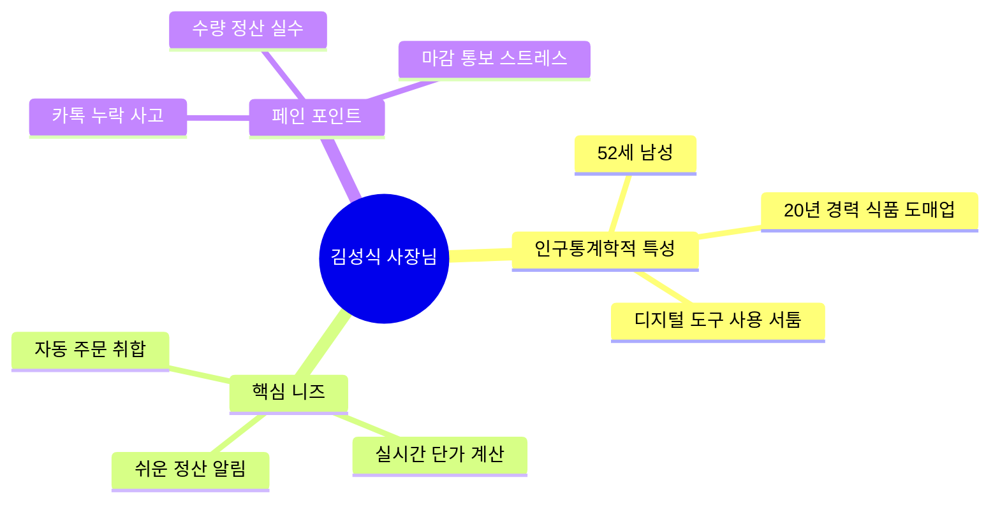
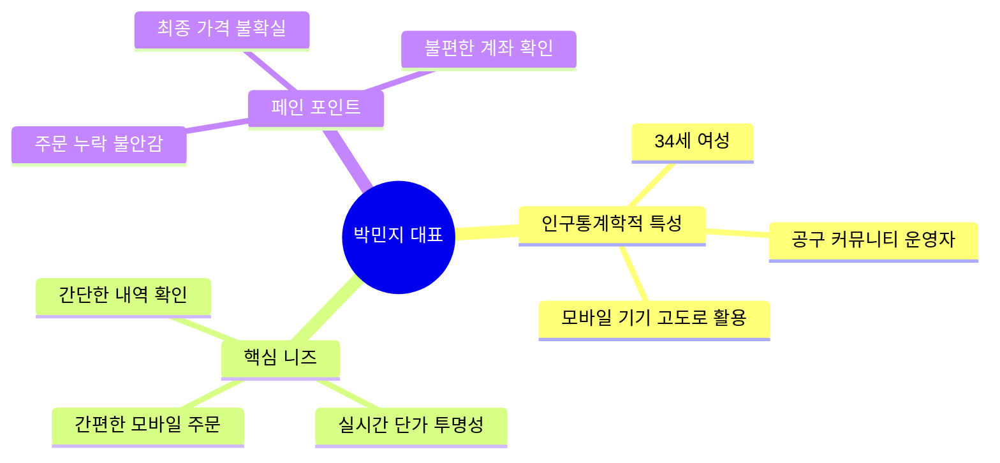

# 사용자 페르소나 (Personas) 정의

공동구매 주문 관리 시스템의 실질적인 설계와 UX 방향성을 도출하기 위해, 핵심 사용자층을 대변하는 2명의 페르소나를 정의합니다.

---

## 👨‍💼 Persona 1: 공급자 (식품 도매업체 사장님)

> *"하루 종일 카톡 알림 지옥과 취합 오류 스트레스에서 벗어나 정산까지 한 번에 끝내고 싶습니다."*

### 1. 프로필
* **이름**: 김성식 (52세, 남성)
* **역할**: '성식농산' 대표 (식품 도매 공급자)
* **디지털 숙련도**: 보통 (카카오톡, 네이버 밴드, 유튜브 시청 위주 사용. 복잡한 ERP나 주문 관리 솔루션 도입 실패 경험 있음)
* **상황**: 20~30명의 고정 공동구매 업자들에게 농산물을 공급하며, 매일 오전 9시부터 오후 5시까지 카톡으로 주문을 받음.

### 2. 행동 패턴 (Behavioral Patterns)
* 매일 아침 카톡으로 당일 취급 품목 15~20개의 리스트와 시작 단가를 공지함.
* 수시로 울리는 카톡 알림을 확인하고 개인 수첩에 수량과 업자명을 수기로 적음.
* 오후 5시 마감 시점에 수첩에 적힌 숫자를 계산기로 모두 더해 누적 수량을 구한 뒤, 사전에 약속된 수량별 단가 테이블을 보고 최종 단가를 결정함.
* 다시 30명의 업자들에게 개별 카톡을 보내 최종 단가와 입금액, 계좌번호를 전달함.

### 3. 페인 포인트 (Pain Points)
* **정리 누락 및 오입력**: 카톡 대화가 쌓이다 보니 주문을 확인하고도 수첩에 적지 않아 배송이 누락되거나 수량을 잘못 적는 배송 사고가 주 1~2회 발생.
* **정산 커뮤니케이션 피로도**: 마감 후 30명에게 일일이 카톡 메시지를 복사/붙여넣기하여 정산 금액을 보내는 데만 1시간 이상 소요.
* **단가 문의 응대**: "지금 몇 박스 모였어요?", "단가 얼마까지 내려갔어요?"라는 업자들의 실시간 질문에 일일이 답변하느라 본업(포장, 검수)에 집중하기 어려움.

### 4. 솔루션 매핑 (Features for Persona 1)
* **심플한 주문 취합 현황판**: 복잡한 설정 없이 오늘 들어온 주문이 실시간으로 표 형태(Table)로 누적 취합되는 화면 제공.
* **자동 슬라이딩 단가 적용**: 시스템이 누적 주문 수량을 인식하여 자동으로 최종 단가를 적용 및 표기.
* **알림톡 일괄 발송**: 마감 버튼 클릭 한 번으로 모든 주문 업자에게 최종 정산 안내 메시지(알림톡)가 자동 일괄 발송되는 기능.

---

## 👩‍💻 Persona 2: 구매자 (공동구매 주관 업자)

> *"이동 중에 스마트폰 하나로 빠르고 정확하게 주문하고, 실시간으로 할인율을 투명하게 확인하고 싶어요."*

### 1. 프로필
* **이름**: 박민지 (34세, 여성)
* **역할**: 온라인 지역 커뮤니티 공동구매 대표 (소매 업자)
* **디지털 숙련도**: 높음 (스마트폰 활용 능력이 뛰어나며 노션, 카카오톡 채널, 인스타그램 등을 비즈니스에 적극 활용)
* **상황**: 회원 수 5,000명의 지역 맘카페에서 공동구매를 주관하여 주문을 취합한 뒤, 김성식 사장님에게 일괄 발송을 요청함.

### 2. 행동 패턴 (Behavioral Patterns)
* 주로 차량 이동 중이나 외부 미팅 중에 모바일 스마트폰을 사용하여 거래처 주문을 처리함.
* 사장님의 개인 카톡으로 "오늘 감자 10박스, 양파 5박스 넣어주세요"라고 빠르게 텍스트로 주문을 보냄.
* 공구 단가가 떨어질수록 마진이 올라가거나 맘카페 회원들에게 더 저렴하게 제공할 수 있으므로 오늘 총 누적 수량이 얼마나 쌓였는지에 매우 민감함.

### 3. 페인 포인트 (Pain Points)
* **주문 확인에 대한 불안**: 사장님이 바빠서 카톡을 읽고도 답장을 안 하면 주문이 정상적으로 들어갔는지 불안해서 전화를 다시 걸어야 함.
* **불투명한 단가**: 마감 전까지 최종 단가가 얼마가 될지 실시간으로 알 수 없어 맘카페 회원들에게 공구 안내를 할 때 마진 계산이나 단가 공지를 즉시 하기 어려움.
* **정산 내역 관리 불편**: 과거에 어떤 품목을 몇 개 주문했는지 카톡 대화방을 위로 올려가며 일일이 검색해야 하므로 월말 정산 시 내역 대조가 매우 번거로움.

### 4. 솔루션 매핑 (Features for Persona 2)
* **챗봇 간편 주문**: 카톡 채팅방에서 이탈하지 않고 공식 채널 챗봇 버튼 클릭 몇 번으로 정확하게 품목과 수량을 선택해 주문.
* **실시간 공구 현황판 제공**: 챗봇 내 링크를 통해 오늘 적용된 실시간 단가 구간과 누적 주문량을 비주얼 그래프로 바로 확인.
* **즉시 확인증 및 정산 알림**: 주문 완료 즉시 카톡으로 확정 안내 템플릿이 오고, 마감 시 정확한 계좌와 최종 정산서 링크가 와서 터치 한 번으로 복사 및 송금 가능.
