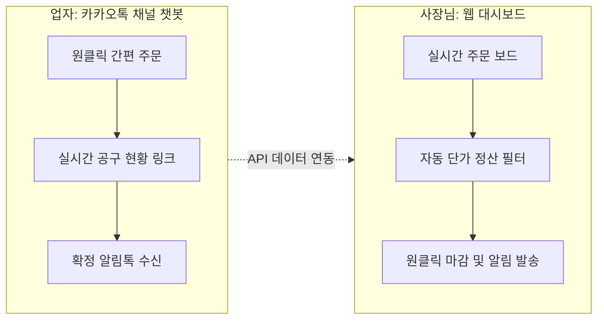

# 솔루션 아이데이션 (Solution Ideation) 보고서

이전 단계에서 정의한 **핵심 문제**, 기존 대안들의 한계점인 **LOFA**, 그리고 사용자의 근본적인 기능적/정서적 목표인 **JTBD (Jobs-to-be-Done)**를 종합하여 최적의 제품 솔루션 안을 도출합니다.

---

## 1. JTBD (Jobs-to-be-Done) 프레임워크 분석

사용자가 제품을 고용(Hire)하여 달성하고자 하는 근본적인 일(Job)을 정의합니다.

### 👨‍💼 공급자 (사장님) 관점
* **기능적 Job**: "매일 주문을 누락 없이 신속하게 취합하고, 복잡한 수량 계산 없이 마감 후 정산액을 업자들에게 바로 통보하고 싶다."
* **감정적 Job (안도감)**: "마감 시간 주문 누락이나 금액 오기재로 인한 배송 사고 및 단골 거래처 신뢰 훼손 스트레스에서 벗어나고 싶다."
* **사회적 Job**: "업자들에게 체계적이고 신뢰할 만한 현대적인 도매 비즈니스 파트너로 보이고 싶다."

### 👩‍💻 구매자 (업자) 관점
* **기능적 Job**: "외부 이동 중에도 스마트폰으로 간편하게 주문하고, 내가 오늘 적용받는 실시간 단가 혜택을 투명하게 확인하고 싶다."
* **감정적 Job (확신)**: "내 주문이 공급자에게 정상 접수되었는지 계속 확인할 필요 없이 확실하게 확인증을 즉시 받고 싶다."

---

## 2. LOFA 및 제약사항 반영 솔루션 매칭

기존 대안들의 실패 요인을 피해 가기 위한 설계 원칙을 수립합니다.

| 기존 대안의 한계 (LOFA) | 솔루션의 해결 전략 (Constraint-Fit) |
| :--- | :--- |
| **새로운 앱 설치 및 회원가입 귀찮음** | **카카오 채널 연동 챗봇**: 가입이나 앱 다운로드 없이 카톡방에서 모든 터치 액션 완료. |
| **엑셀 시트 모바일 뷰어 불편 및 오수정 우려** | **읽기 전용 실시간 현황판**: 모바일에 최적화된 웹 링크를 챗봇 메뉴로 제공하되 수정은 불가능하게 제한. |
| **일반 쇼핑몰의 고정가 판매 한계** | **실시간 구간 단가 계산 엔진**: 누적 합계 수량에 따라 적용 가격 구간이 유동적으로 차감 표시되는 데이터베이스 연동. |

---

## 3. 핵심 솔루션 아이디어 구체화

### 💡 솔루션명: **봉봉 마켓 (BongBong Market) - 카톡 연동 공구 관리 솔루션**

### 1) [주문] 카톡 챗봇 간편 주문 양식
* **주문 입력 최소화**: 카카오톡 채널 채팅방 내 스마트 채팅 또는 시나리오 챗봇 활용. 업자는 텍스트 타이핑 대신 **[품목 선택] -> [수량 선택] -> [배송요청]** 버튼 터치만으로 주문 완료.
* **즉시 피드백**: 주문이 완료되면 봇이 자동으로 "주문이 완료되었습니다! (감자 10박스)"라는 주문 요약 카드를 채팅방으로 발송해 업자의 불안감 원천 차단.

### 2) [조회] 실시간 공구 달성도 그래프 (Web View)
* 챗봇 메뉴 중 **[실시간 공구 현황 보기]** 버튼을 누르면 모바일에 최적화된 마이크로 페이지가 열립니다.
* **"현재 당근 120박스 모집 중! 다음 20% 할인 구간까지 단 30박스 남았습니다!"**와 같은 게이지 바 그래프를 띄워 실시간 정보 투명성을 제공하고, 업자들의 추가 구매 심리(공구 촉진) 유도.

### 3) [정산] 자동 슬라이딩 가격 계산기 & 알림톡 정산 청구
* 사장님 관리 도구에 주문이 실시간 취합되며, 시스템이 구간 가격 규칙(예: 1~50개: 2만원, 51~100개: 1.8만원 등)을 적용해 자동으로 계산해 줍니다.
* 마감 처리 시 **"카카오 알림톡 일괄 발송"** 버튼을 누르면, 시스템이 각 업자별 주문 목록과 최종 단가로 계산된 금액을 계산해 개인 카톡 메시지로 청구서 폼을 자동 발송합니다.
