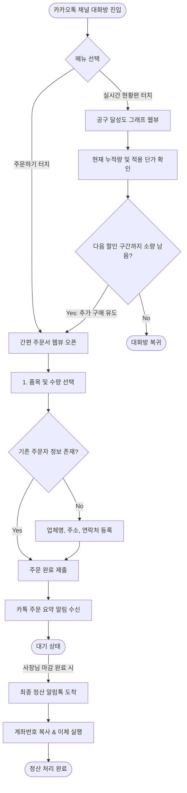
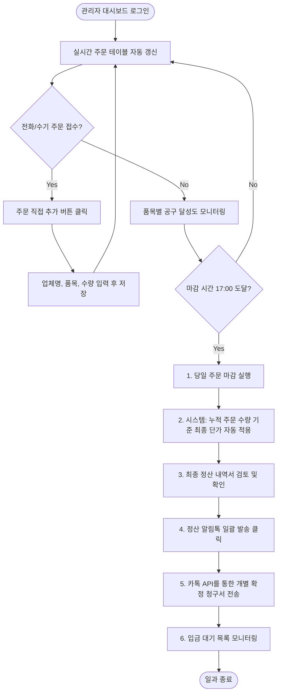

# 사용자 흐름도 (User Flow)

봉봉 마켓(BongBong Market) 서비스를 이용하는 **두 가지 핵심 페르소나(구매자 박민지, 공급자 김성식 사장님)**의 업무 진행 및 시스템 상호작용 단계를 상세히 시각화한 사용자 흐름도입니다.

---

## 1. 구매자(업자)의 주문 및 실시간 단가 조회 흐름 (Buyer User Flow)

구매자가 카카오톡 채널에 진입하여 주문을 접수하고, 공구 혜택을 확인하며, 최종 마감 정산 내역을 수신하기까지의 동선입니다.

---

## 2. 공급자(사장님)의 일일 취합, 마감 및 정산 흐름 (Supplier User Flow)

도매 사장님이 당일 주문 상황을 모니터링하고, 전화 주문 예외 처리를 거쳐 당일 공동구매를 마감 및 정산 통보하는 동선입니다.

